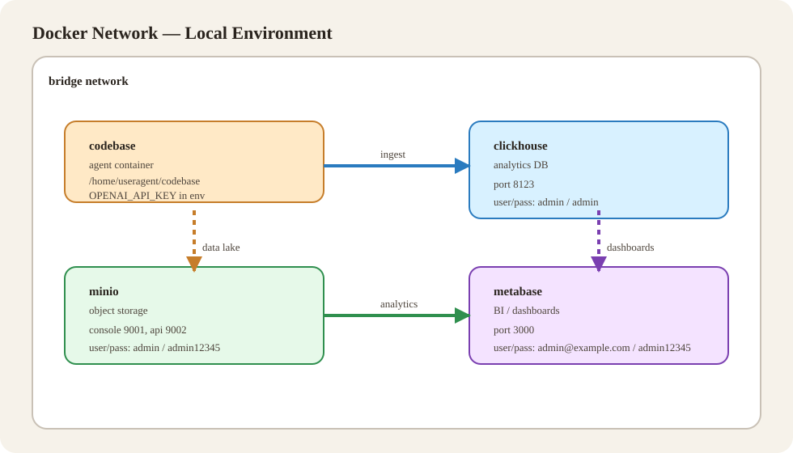

# Environment Setup

This folder contains everything needed to build and run the local environment (containers, scripts, data, and config). It keeps deployment and runtime artifacts separate from the Python `codebase/`.

For the main project overview, see the repo root `README.md`.

<span style="color: #b00020; font-weight: 700;">Important: Put your OpenAI API key in `environment_setup/.openapi_env` as `OPENAI_API_KEY=...` (do not store it in `.env`).</span>

## Contents

- `compose.yaml` Docker Compose file that orchestrates all services.
- `Dockerfile` Ubuntu-based image for interactive development/utility use.
- `Dockerfiles/` Service Dockerfiles for agent, ClickHouse, MinIO, and Metabase init.
- `scripts/` Container entrypoints and helper scripts (e.g., MinIO seeding, Metabase init).
- `synthetic_data/` Sample data seeded into MinIO at startup.
- `sql/` Database initialization SQL (ClickHouse).
- `.env` Environment variables used by containers and the app.
- `requirements.txt` Python dependencies used by the agent image.

## How To Start

From the repo root:

```bash
# Build and start all services
docker compose -f environment_setup/compose.yaml up -d --build

# Follow logs (optional)
docker compose -f environment_setup/compose.yaml logs -f
```

Or use the helper script:

```bash
# Start
./environment_setup/environment.sh start

# Stop
./environment_setup/environment.sh stop

# Restart
./environment_setup/environment.sh restart
```

## Libraries That Are Installed In The Codebase Development Docker

- `openai`
- `langchain`
- `fastapi`
- `uvicorn`
- `pydantic`
- `requests`
- `openpyxl`
- `docling`
- `langgraph`
- `langchain-openai`
- `tiktoken`
- `pypdf`
- `python-multipart`
- `pandas`
- `pyarrow`
- `clickhouse-connect`
- `tenacity`
- `rich`
- `minio`
- `ipykernel`


## Effects Of Starting The Environment

- Builds Docker images for the agent, ClickHouse, MinIO, and Metabase init.
- Starts containers:
  - `codebase` (agent development container)
  - `clickhouse`
  - `minio`
  - `metabase`
  - `metabase-init` (runs once and exits)
- Seeds MinIO with `synthetic_data/` on first run.
- Initializes ClickHouse using `sql/clickhouse-init.sql`.

## Container Network Diagram



## Notes

- The Compose file uses `codebase/` as the mounted source directory at `/home/useragent/codebase` inside the agent container.
- The `.env` file in this folder is the single source of environment variables for all services.
- If you rename services or paths, update `compose.yaml` and the Dockerfiles in `Dockerfiles/` accordingly.
